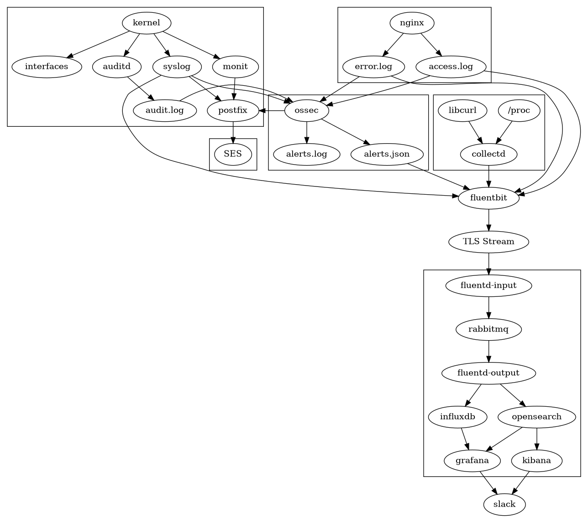

# Monitoring Stacks

This repo contains some POC/Experimental monitoring solutions to help me decide on _The Ultimate System_. 

Together, the pieces will form the essentials of a comprehensive monitoring system: 

* Intrusion detection
  * Host based IDS (OSSEC)
  * Network IDS (Suricata)
* Syslog server
  * Journald + Auditd
  * Web server access/error logs
  * Searchable and alertable data aggregation
  * Elasticsearch or Solr nosql database
* Metrics system
  * Real-time performance data
  * Configurable data retention
  * Influxdb v2 time-series storage
* Data visualization
  * Kibana 
  * Grafana
  * Influx 
* Alerting
  * SMTP/Email alerts (Per host)
  * Slack alerts (Per host)

Contrary to most mainstream monitoring systems, this one places the burden largely on the endpoint to parse and timestamp all the logs and data before sending it back to the server. 

### Data formats: 

The agent should be able to collect data from various local data sources: 

  * Suricata `eve.json` logs (If NIDS is available)
  * OSSEC `alerts.json` logs (If HIDS is available)
  * Syslogs; or `journald` integration
  * auditd parsing
  * httpd (apache/nginx) access/error logs (If appropriate software is installed)
  * Metrics - A local agent should push metrics to a local listener

### Metadata 

  * GeoIP (maxmind geolite2)
  * Whois data
  * Threat intel feeds (?)
  * Source/dest lookups

### Timestamps

As logs and metrics are time-series data, date parsing (from UTC) should always produce an accurate timestamp. At a minimum, each input should be able to stop and resume processing, and still produce accurate information on the server side. 

### Security

Since this system will send a lot of data across insecure channels, there should be a single secure TLS connection between each client and the server, regardless if it is in a private or public network. Connecting a remote system should not require any specialized networking such as IPsec or OpenVPN to be considered secure. 

### Buffering

Both the server and client will have disk and memory buffers enabled to prevent data loss form transient network outages. Unlike other systems, these conditions are expected and shouldn't be a problematic situation to recover from. 

And, most of all, it should be __durable__. Each stage of the pipeline should have the ability to store and retry failed submissions, and there shouldn't be any situation where logs or metrics get dropped. A brief outage should be possible at any point without the loss of timeseries data. While some teams opt for a highly-available system with loadbalancers and highly replicated databases, this should run on a system with plenty of points of failure. 

## Prototypes

A few prototypes are being built: 

1. Elasticsearch + Fluentd
2. Apache Solr + Fluentd
3. Elasticsearch + Logstash
4. Collectd + Fluentd/Fluentbit + InfluxDB

Some additional systems are being considered as well: 

1. Postgresql + Fluentd
2. Timescaledb + Fluentd/fluentbit

## Links & Resources

* https://github.com/influxdata/influxdb-plugin-fluent
* https://github.com/haruyama/fluent-plugin-out-solr
* https://www.influxdata.com/products/influxdb-overview/influxdb-2-0/
